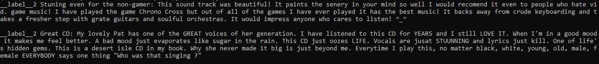
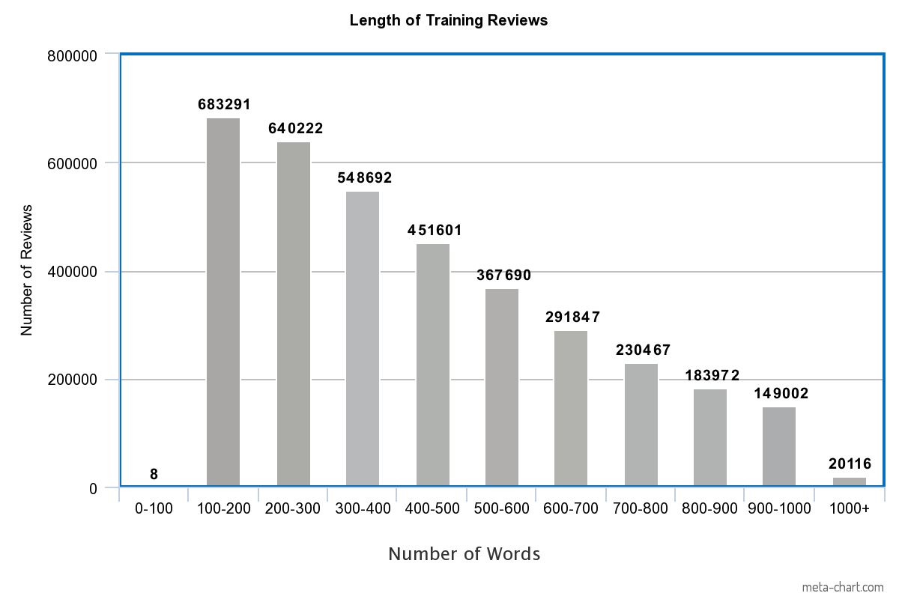
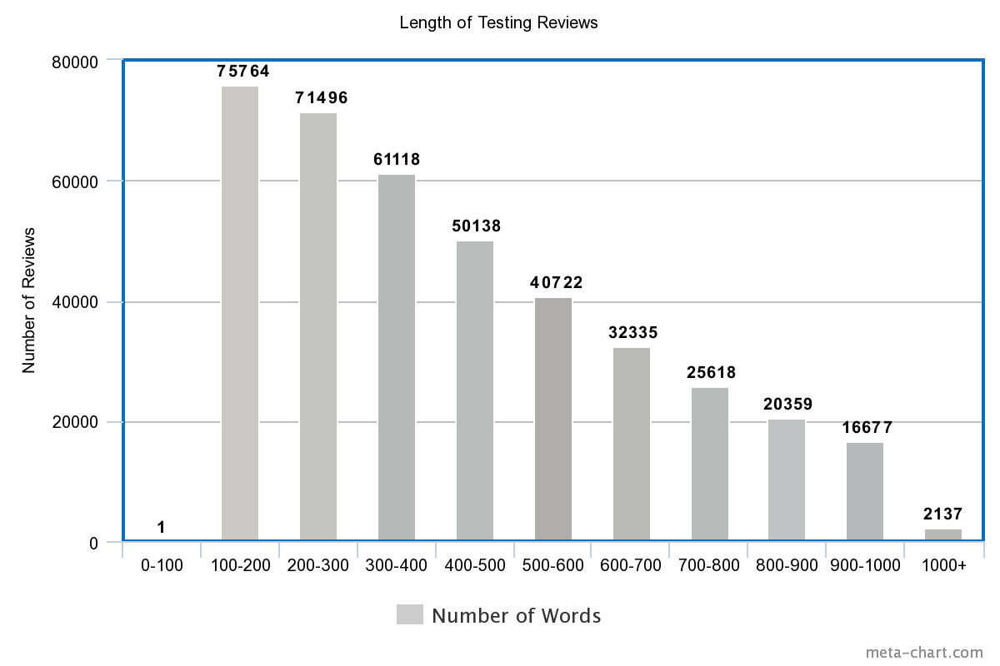

# Dataset

In this project, the "Amazon Reviews for Sentiment Analysis" dataset was used. It is composed of the raw text data from reviews of Amazon products, along with binary sentiment labels corresponding to product ratings. In the full dataset, there are 3.6 million training data points and 400 thousand testing data points, for a total of 4 million data points. 

## Data Points

Individual data points consist of a sentence-long review of an individual Amazon product and a corresponding binary label describing the sentiment contained within ("good" or "bad"). These reviews are raw text input, while the labels are strings corresponding to "label 1" and "label 2". "Label 1" is given to 1 and 2 star Amazon reviews ("bad" sentiment) while "Label 2" is given to 4 and 5 star reviews ("good sentiment").

__Figure 1: Read out of two different data points.__

## Training Data Set

Within the training dataset, there is a wide variance in the length of reviews. They range anywhere from 72 words to 1,015 words.

__Figure 2: Distribution of training reviews in terms of word count.__

In terms of sentiment, the training dataset is divided directly in half. 1.8 million of the reviews have a "good" sentiment label and another 1.8 million have a "bad" sentiment label.

## Testing Data Set

Within the testing dataset, there is also a wide variance in the length of reviews. They range anywhere from 99 words to 1,015 words.

__Figure 3: Distribution of testing reviews in terms of word count.__

In terms of sentiment, the testing dataset is divided directly in half. 200 thousand of the reviews have a "good" sentiment label and another 200 thousand have a "bad" sentiment label.

## Pre-Processing

The raw text input in the dataset was cleaned up a bit, with all URLs replaced with a generic URL tag and all numbers removed.

## Word Vectors

To use raw text data as input for a neural network, words must be turned into semantics-preserving word vectors. I used a pre-trained model for this, the GloVe twitter word vector set. If a word was discovered in the raw text input that did not have a corresponding word vector, it was removed.

For the training data set, approximately 14% of words needed to be removed. Within individual data points, the vast majority retained most of their content: 3,440,681 / 3,600,000 had 75-100% of their words vectorized.

For the testing data set as well, approximately 14% of words needed to be removed. Within individual data points, the vast majority retained most of their content: 382,445 / 400,000 had 75-100% of their words vectorized.
