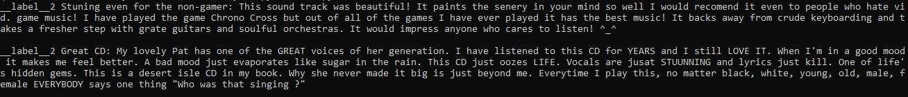

# Dataset

In this project, the "Amazon Reviews for Sentiment Analysis" dataset was used. It is composed of the raw text data from reviews of Amazon products, along with sentiment labels corresponding to product ratings. In the full dataset, there are 3.6 million training data points and 400 thousand testing data points, for a total of 4 million data points. 

## Data Points

Individual data points consist of a sentence-long review of an individual Amazon product and a corresponding binary label describing the sentiment contained within ("good" or "bad"). These reviews are raw text input, while the labels are strings corresponding to "label 1" and "label 2". "Label 1" is given to 1 and 2 star Amazon reviews ("bad" sentiment) while "Label 2" is given to 4 and 5 star reviews ("good sentiment").

__Figure 1: Read out of two different data points.__
